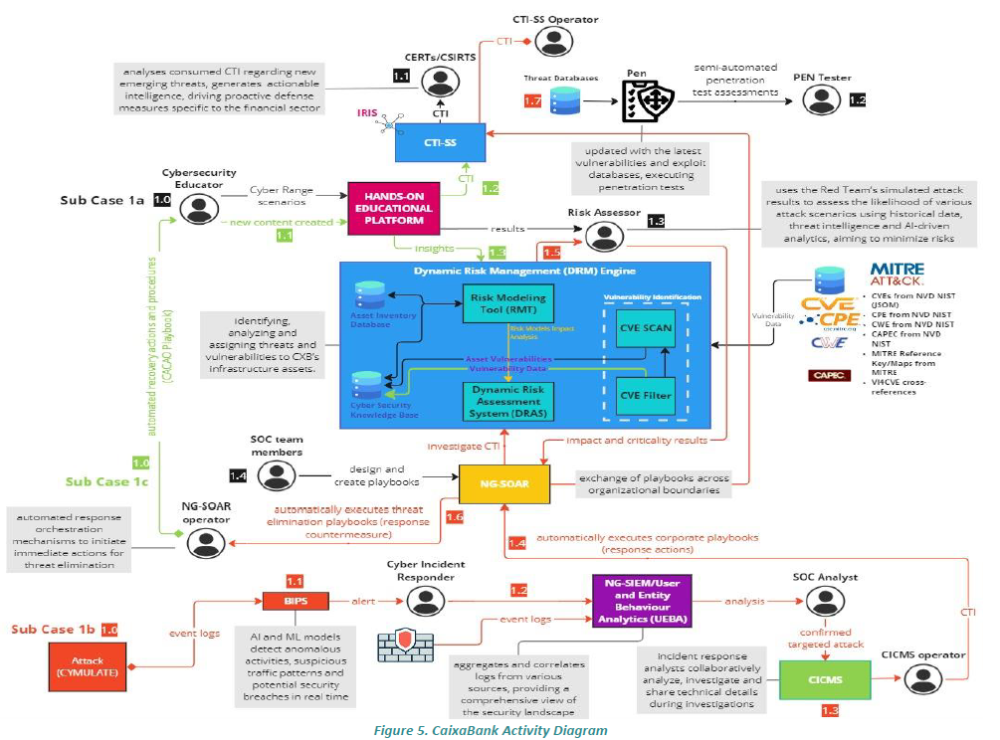

# riskmanagementrita-crcz

This repository contains all resources required to deploy and run **Learning Module 2 – Risk Management** 
on the [CyberRangeCZ Platform](https://docs.platform.cyberrange.cz/).

## Structure

```
.
├── training.yaml                # CRCZ training definition
├── content/                     # Exercise descriptions
│   ├── exercise1.md
│   └── exercise2.md
├── sandboxes/                  # Network topologies and provisioning
│   ├── topology_puc1.yaml
│   ├── topology_puc3.yaml
│   └── provisioning_puc1/
│       └── site.yml
│   └── provisioning_puc3/
│       └── site.yml
├── static/                     # Visual assets (e.g., diagrams)
│   ├── diagram_banking.png
│   └── diagram_energy.png
└── README.md                   # This file
```

## Exercises

- `Exercise 1`: Risk assessment and threat modelling in a **banking system**  

Based on:


- `Exercise 2`: ICS/SCADA-focused risk assessment for an **energy infrastructure**

Based on:


## Roles Targeted

- Cybersecurity Risk Manager
- Security Architect
- OT/ICS Security Analyst

## Standards and Frameworks

- MITRE ATT&CK
- STRIDE Threat Modelling
- ENISA ECSF Competence Mapping
- ISO 27005, IEC 62443 (for ICS)

## Usage

1. Deploy using the CyberRangeCZ Platform interface.
2. Load the provided topologies and provisioning playbooks.
3. Follow the instructions in the markdown files within `content/`.

## Using RITA

RITA (Risk Identification and Threat Assessment) provides a web interface for
cataloguing assets, mapping threats and recording risk calculations throughout
the exercises. Access it from any machine in the training environment using:

- **URL:** `https://ng-soc.eurodyn.com/login`
- **Username:**
- **Password:**

Refer to the [RITA guide](content/rita_guide.md) for step-by-step instructions on logging in, creating assets, mapping threats and vulnerabilities, evaluating risk, and importing data. The exercises require using RITA to build asset inventories, model threats and document overall risk evaluations.

## Deployment

To run this training on the CyberRangeCZ Platform:

1. **Install prerequisites** – Ansible 2.12+ is recommended. The provisioning playbooks use the `sysctl` module from the `ansible.posix` collection. Install it before running the playbooks:

   ```bash
   ansible-galaxy collection install ansible.posix
   ```
2. **Import the training** – Log in to CyberRangeCZ Platform and navigate to *Training Management → Import*. Upload all files from this repository, including `training.yaml`.
3. **Select a sandbox variant** – When launching a scenario, choose either:
   - `sandboxes/topology_puc1.yaml` (banking use case), or
   - `sandboxes/topology_puc3.yaml` (ICS use case).
4. **Run the provisioning playbook** – For the chosen topology, execute the matching playbook from `sandboxes/provisioning_puc1/site.yml` or `sandboxes/provisioning_puc3/site.yml`.
5. **Start the exercise** – After provisioning completes, trainees can follow the steps in `content/exercise1.md` or `content/exercise2.md` as appropriate.

## Getting Started

Once the environment has been deployed, connect via **SSH** to the desired host using the management account `debian`:

```bash
ssh debian@<IP or host-name>
```

The default password is usually `debian` unless the instructor states otherwise.

Recommended workflow:

1. Open a terminal in the CRCZ interface and first connect to the main analyst machine (`bank-analyst` or `corp-workstation`).
2. From there, access the remaining scenario machines with `ssh`.
3. Refer to the exercise guide in the `content/` folder (`exercise1.md` or `exercise2.md`).
4. Save notes and evidence in your home directory (`/home/debian`) or in the location specified by the course.
