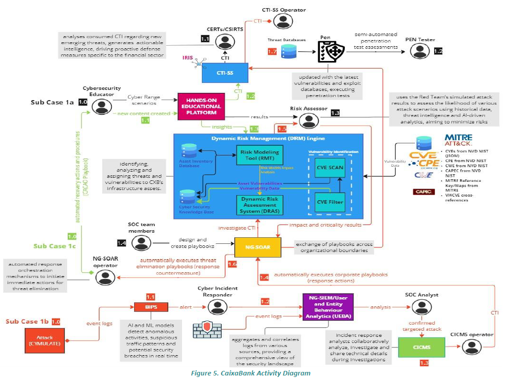

# Exercise 1 – Risk Assessment and Threat Modelling for a Banking System (PUC1 – Financial Sector)

## Scenario
You are the Cybersecurity Risk Manager for a major retail bank offering online services. Recent threat intelligence reports indicate that cybercriminal groups are targeting banking web applications and payment systems to commit fraud and exfiltrate sensitive customer data. Explore the virtual machines (`bank-analyst`, `bank-web`, `bank-db`) to identify high-value assets and possible attack paths.

### Environment Diagram


### Connection Guide
1. Open a terminal in the CyberRangeCZ interface.
2. Connect to the analysis workstation:
   ```bash
   ssh <user>@bank-analyst
   ```
3. From `bank-analyst`, connect to the web server and database:
   ```bash
   ssh <user>@bank-web
   ssh <user>@bank-db
   ```
   Replace `<user>` with the credentials provided by the instructor.
4. Use `nmap` to scan services on `bank-web` and `bank-db` and `wireshark` (or `tcpdump`) to capture traffic between the machines.

## Steps
1. Map critical assets and data flows between the provided machines.
2. Log into RITA and model bank assets, threats, and countermeasures following the [RITA guide](rita_guide.md).
3. Build threat scenarios using STRIDE and MITRE ATT&CK techniques.
4. Assess the likelihood and impact of each scenario.
5. Propose mitigations and prioritise them in a risk treatment plan.
6. Prepare documentation for technical and executive audiences.

## Deliverables
The exercise report should include:
- **Threat model** – A diagram or table describing assets and mapped threats.
- **Risk matrix** – A 5×5 grid (likelihood vs. impact). Example template:
  | Impact \ Likelihood | Very Low | Low | Medium | High | Critical |
  |---------------------|----------|-----|--------|------|----------|
  | Very Low            |          |     |        |      |          |
  | Low                 |          |     |        |      |          |
  | Medium              |          |     |        |      |          |
  | High                |          |     |        |      |          |
  | Critical            |          |     |        |      |          |
- **RITA risk evaluation results** – Export or screenshot the risk assessment output from RITA.
- **Risk treatment plan** – Recommended mitigations ordered by priority.
- **Executive summary** – One page of key findings for leadership.

## Target Roles
- Cybersecurity Risk Manager
- Security Architect
- SOC Analyst

## Reflection Prompts
- Which threats require immediate mitigation and why?
- How would you communicate residual risk to leadership?

## Skills Covered
- Threat modelling, risk analysis, control design
- Risk communication and prioritisation
- Strategic decision-making under uncertainty
