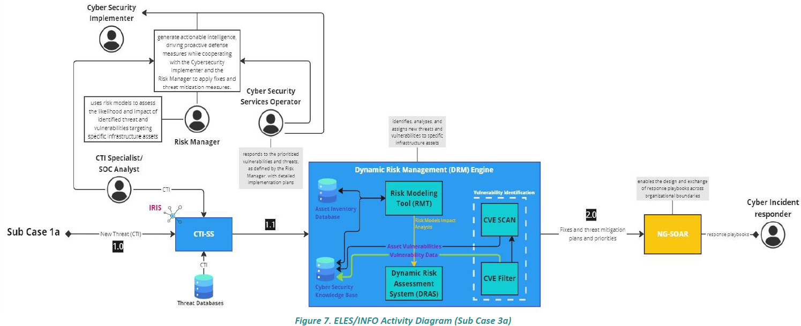

# Exercise 2 – Risk Assessment and Threat Modelling for an Energy Infrastructure (PUC3 – ICS Sector)

## Scenario
You are acting as the Cybersecurity Risk Manager for a national power transmission operator. The environment includes IT/OT interconnection, SCADA servers, RTUs and engineering workstations. Alerts about ICS-specific malware highlight the need for proactive risk analysis. Use the virtual machines (`corp-workstation`, `scada-server`, `substation-rtu`) to explore how the IT and OT networks interact.

### Environment Diagram


### Connection Guide
1. Open a terminal via the CyberRangeCZ interface.
2. Connect to the corporate workstation:
   ```bash
   ssh <user>@corp-workstation
   ```
3. From there, connect to the SCADA server and the substation RTU:
   ```bash
   ssh <user>@scada-server
   ssh <user>@substation-rtu
   ```
   Replace `<user>` with the login provided by the instructor.
4. Use tools such as `nmap` to map reachable services and `wireshark` to inspect industrial protocols.

## Steps
1. Identify ICS and IT assets critical to operations.
2. Use RITA to model ICS assets, potential threats and vulnerabilities as described in the [RITA guide](rita_guide.md).
3. Model threat scenarios such as malware propagation from IT to OT, insider manipulation of SCADA and unauthorised RTU commands.
4. Assess safety, operational and strategic impact.
5. Recommend controls suited for industrial environments.
6. Summarise findings in a risk report for leadership and engineers.

## Deliverables
Your submission should include:
- **ICS threat model** – Diagram or table highlighting data flows and attack vectors.
- **Risk matrix** – Use a 5×5 format considering operational impact. Example template:
  | Impact \ Likelihood | Very Low | Low | Medium | High | Critical |
  |---------------------|----------|-----|--------|------|----------|
  | Very Low            |          |     |        |      |          |
  | Low                 |          |     |        |      |          |
  | Medium              |          |     |        |      |          |
  | High                |          |     |        |      |          |
  | Critical            |          |     |        |      |          |
- **RITA-generated risk report** – Export outlining energy infrastructure assets, threats and vulnerabilities.
- **Mitigation plan** – Prioritised recommendations for protecting the OT network.
- **Cyber risk report** – Summary for technical leads and executives.

## Target Roles
- Cybersecurity Risk Manager
- OT/ICS Security Analyst
- Security Architect

## Reflection Prompts
- What is the most significant safety risk identified?
- Which mitigations are most challenging to implement and why?

## Skills Covered
- ICS/OT-specific risk management
- Security architecture for critical infrastructure
- Balancing availability, safety and cyber defences
